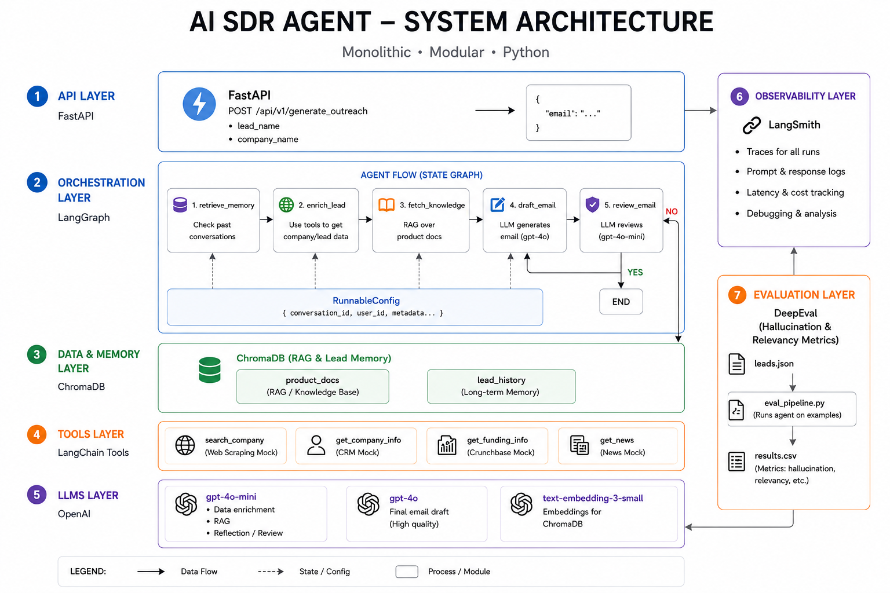
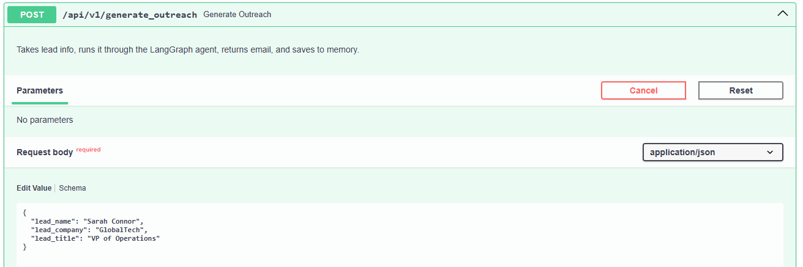
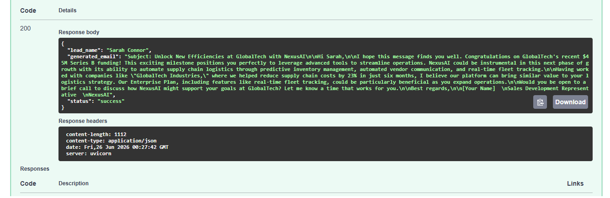
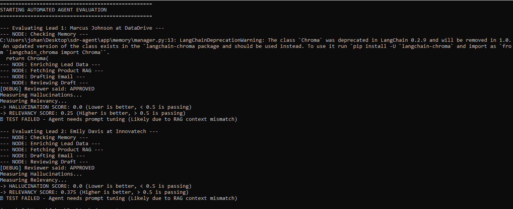

# AI SDR Agent

An autonomous multi-agent AI system that acts as a **B2B Sales Development Representative (SDR)**. It researches prospective leads, retrieves relevant product knowledge through Retrieval-Augmented Generation (RAG), checks previous interactions using long-term vector memory, and generates hyper-personalized outreach emails through a LangGraph workflow with automated self-review.

The project demonstrates production-oriented GenAI engineering practices, including multi-agent orchestration, tool calling, RAG, vector memory, prompt evaluation, and cost-optimized LLM routing.

---

## Demo

### Architecture

<p align="center">

</p>

---

### API

<p align="center">

</p>

---

### Generated Email

<p align="center">

</p>

---

### Evaluation Results

<p align="center">

</p>

---

# Features

- Multi-agent workflow built with LangGraph
- Retrieval-Augmented Generation (RAG) using ChromaDB
- Long-term vector memory to prevent duplicate outreach
- CRM and external tool integration
- Automated email quality review with Reflexion
- Cost-optimized LLM routing
- REST API with FastAPI
- Automated prompt evaluation using DeepEval

---

# Workflow

The agent follows the pipeline below:

1. Receive lead information
2. Search CRM for previous interactions
3. Retrieve recent company information
4. Retrieve product knowledge from the vector database
5. Search long-term memory for similar outreach
6. Generate a personalized sales email
7. Review the email with a secondary LLM
8. Rewrite if necessary
9. Return the final response

---

# Architecture

This project uses a stateful multi-agent workflow built with **LangGraph**.

The workflow consists of specialized nodes responsible for different tasks:

- CRM Lookup
- Web Research
- Product Knowledge Retrieval (RAG)
- Long-Term Memory Retrieval
- Email Drafting
- Email Review
- Conditional Rewrite
- Final Response

A recursion limit prevents infinite rewrite loops during self-review.

---

# Tech Stack

| Component | Technology |
|------------|------------|
| Agent Framework | LangGraph |
| LLMs | OpenAI GPT-4o / GPT-4o-mini |
| API | FastAPI |
| Vector Database | ChromaDB |
| Embeddings | OpenAI Embeddings |
| Evaluation | DeepEval |
| Memory | Vector Similarity Search |
| Language | Python |

---

# Cost Optimization

Instead of using the largest model for every task, the workflow routes requests based on complexity.

| Task | Model |
|-------|-------|
| Retrieval reasoning | GPT-4o-mini |
| Email review | GPT-4o-mini |
| Rewrite decisions | GPT-4o-mini |
| Final email generation | GPT-4o |

This reduces inference costs while maintaining high-quality outputs.

---

# Design Decisions

These are some of the non-obvious choices made during development, and the reasoning behind each one.

## Why LangGraph instead of a linear chain?

The short answer: the workflow has branching logic and shared state, and linear chains just aren't built for that.

A simple `chain A → B → C` works fine when every step always runs in the same order. But this agent needs to decide things mid-run — should it rewrite the email or approve it? Has this lead already been contacted? That kind of conditional routing requires a proper graph structure, not a sequential pipe.

LangGraph gives you a shared state object that all nodes can read from and write to, which means each step has full context of what happened before it. It also handles recursion limits natively, which is critical when you have a review-rewrite loop that could theoretically run forever.

Could we have built this with plain Python and some `if` statements? Sure. But LangGraph makes the control flow explicit, debuggable, and easy to extend. When you add a new node, you wire it into the graph — you don't go hunting through nested conditionals to figure out where it fits.

## Why GPT-4o for final generation and GPT-4o-mini for everything else?

Because not every task actually needs the most powerful model.

Retrieval reasoning, review decisions, and rewrite checks are all classification-style tasks with relatively constrained outputs. GPT-4o-mini handles these reliably and is significantly cheaper per token. Saving the heavy model for the one task that actually benefits from it — writing a persuasive, context-rich email — keeps costs reasonable without sacrificing quality where it matters.

The practical implication: if you run this at scale (say, 1,000 leads per day), the cost difference between routing smartly and defaulting to GPT-4o everywhere becomes meaningful fast.

## How does vector memory work?

Every time the agent generates an email, it stores an embedding of that outreach in ChromaDB — along with metadata like the lead's company, role, and the date it was sent.

Before drafting a new email for a lead, the agent queries this memory using vector similarity search. If a semantically similar outreach already exists for that company or persona, it surfaces it. The goal is to avoid sending near-identical cold emails to the same organization, which happens more often than you'd expect when SDRs work accounts independently.

The RAG pipeline for product knowledge works similarly: product documentation is chunked, embedded, and stored in ChromaDB ahead of time. At runtime, the agent retrieves only the chunks most relevant to the lead's industry or pain points, rather than dumping the entire knowledge base into the prompt. This keeps context windows lean and responses grounded.

## What happens if the reviewer keeps rejecting the email?

The reviewer is a secondary LLM call that scores the draft against a rubric — checking for things like relevance, tone, specificity, and hallucination risk. If it flags the email, the agent rewrites and tries again.

But this loop can't run indefinitely. LangGraph's recursion limit acts as a hard cap on how many rewrite cycles are allowed. Once that limit is hit, the agent returns whatever the best draft was at that point rather than getting stuck or erroring out.

In practice this is rare — most emails pass review on the first or second attempt. But without the recursion guard, a pathological case (ambiguous lead data, conflicting instructions) could spin forever.

## What are the limitations?

A few honest ones worth knowing before you deploy this in production:

**Tool calls are sequential, not parallel.** The CRM lookup, web research, and RAG retrieval all run one after the other. Each of those is a network or DB call, and they add up. Switching to async execution would cut latency meaningfully, especially at scale.

**Web research is shallow.** The scraper pulls recent information about the lead's company, but it's not doing deep research — no multi-hop queries, no reading full reports, no filtering by source credibility. For leads in fast-moving industries, this context can be stale or thin.

**The reviewer has no external ground truth.** It's a language model evaluating a language model's output. It's good at catching obvious issues, but it's not a guarantee. It won't catch factual errors if the retrieved product docs themselves are wrong or outdated.

**No human-in-the-loop.** Right now, the agent generates and returns. There's no approval step before an email would actually be sent. That's listed as a future improvement, and it's a real gap for any production deployment where you care about brand safety.

**Memory drift over time.** The vector memory grows indefinitely. There's no pruning or TTL logic yet, so over time the similarity search becomes noisier as older, potentially irrelevant outreach accumulates. This is manageable at small scale but worth addressing before a serious production rollout.

---

# Project Structure

```
sdr-agent/
│
├── app/
│   ├── agents/
│   │   ├── graph.py
│   │   ├── nodes.py
│   │   └── state.py
│   │
│   ├── memory/
│   │   └── manager.py
│   │
│   ├── rag/
│   │   ├── ingester.py
│   │   └── retriever.py
│   │
│   ├── tools/
│   │   ├── crm_tool.py
│   │   └── web_scraper_tool.py
│   │
│   ├── config.py
│   └── main.py
│
├── data/
│   ├── db/
│   └── pdfs/
│
├── eval/
│   ├── golden_dataset.json
│   └── run_eval.py
│
├── assets/
│
├── requirements.txt
└── README.md
```

---

# Automated Evaluation

The project includes an automated evaluation pipeline using **DeepEval**.

Two metrics are measured:

- Hallucination
- Answer Relevancy

The evaluation uses a golden dataset of representative sales leads and verifies that generated emails remain grounded in the retrieved product documentation.

Example:

```
Lead 1

Hallucination Score: 0.12

Answer Relevancy: 0.91

Status:
PASS
```

---

# Installation

Clone the repository.

```bash
git clone https://github.com/jayfelipe/sdr-agent

cd sdr-agent
```

Create a virtual environment.

```bash
python -m venv venv
```

Activate it.

Windows

```bash
venv\Scripts\activate
```

Linux / macOS

```bash
source venv/bin/activate
```

Install dependencies.

```bash
pip install -r requirements.txt
```

---

# Environment Variables

Rename

```
.env.example
```

to

```
.env
```

Then configure:

```
OPENAI_API_KEY=your_api_key
```

---

# Build the Vector Database

Before running the agent, ingest the product documentation.

```bash
python -m app.rag.ingester
```

---

# Run the API

```bash
python -m uvicorn app.main:app --reload
```

Swagger UI

```
http://127.0.0.1:8000/docs
```

---

# Run Evaluations

```bash
python -m eval.run_eval
```

---

# Why LangGraph?

Traditional LLM chains are not well suited for workflows involving shared state, conditional branching, iterative self-review, and multiple specialized agents.

LangGraph provides:

- Stateful execution
- Conditional routing
- Agent collaboration
- Controlled recursion
- Modular workflows

making it an ideal orchestration framework for autonomous AI agents.

---

# Future Improvements

- Salesforce integration
- HubSpot integration
- Async tool execution
- Human approval before sending emails
- Streaming responses
- Docker deployment
- CI/CD pipeline
- LangSmith tracing
- Multi-tenant vector memory

---

# License

MIT License
